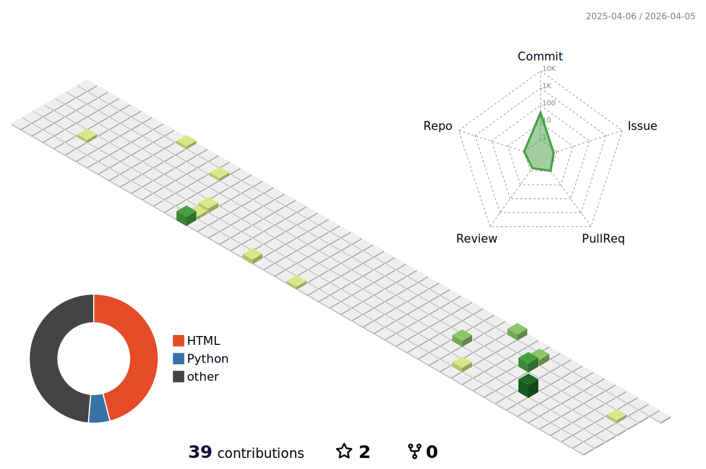

### Hi there 👋

- 🍻 🇨🇳 [XJTU](https://www.xjtu.edu.cn/), _BSc in Software Engineering_
- ⚡ Python & Go & C++ & JAVA & JavaScript.
- 🎄 OS Kernel/ Android/ Cross-platform client development
- ✍️ [Blogger](https://wawzysys.github.io/)
- 🏃 Running(Seldom now)/  BasketBall/ Dating with my sweetheart

<h6>* These nice badges are generated by <a href="https://shields.io/">Shields.io</a> and <a href="https://github.com/spencerwooo/Substats">Substats</a>.</h6>

